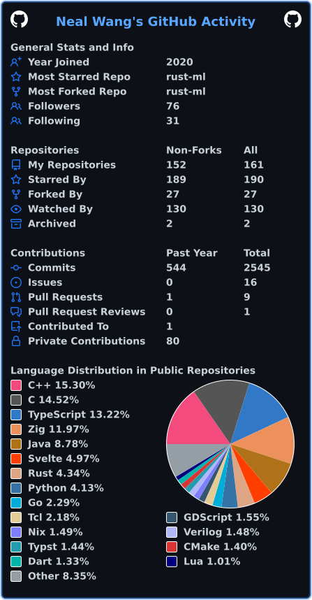

# 🚨 NOTICE: I have migrated my account to [Codeberg](https://codeberg.org/nealwang) 🚨

---

	<h1>Hi! I'm <a href="https://neowsl.github.io">Neal Wang</a> 🐬 !</h1>
    
<code>// TODO: insert inspirational quote</code>

	 
	
	
	
	
	 
	
	
	
	 
	
	
	
	
	
	 
	
	

---

## About Me

**Full-Stack DevSecBizAIOps Ninja Unicorn 🦄 • Cloud-Native Zero-Trust Thought Leader 🧠 • Friday-Afternoon-Force-Push-to-Prod Evangelist 🚨**

- Favourite Languages: Haskell / TailwindCSS / Jira tickets
- Favourite Vim Command: `:norm`
- Favourite Song: ▶︎ •၊၊||၊|။||||။‌‌‌‌‌၊|• 9:12
- Favourite Regex: `^https?:\/\/(www\.)?(youtube\.com\/watch\?v=|youtu\.be\/)(dQw4w9WgXcQ|dQw4w9WgXcQ(&|\?).*|dQw4w9WgXcQ\/.*|.*[&?]v=dQw4w9WgXcQ(&.*)?|.*v%3DdQw4w9WgXcQ.*|.*%2Fwatch%3Fv%3DdQw4w9WgXcQ.*|.*embed\/dQw4w9WgXcQ.*|.*[&?]list=.*dQw4w9WgXcQ.*|.*redirect=.*dQw4w9WgXcQ.*)$`

## Work Experience

- 🔎 Deployed end-to-end serverless, hyperoptimised, micro-monolith logs inspector (RabbitMQ + WebSockets + Kafka-adjacent vibes) for enterprise-grade RCA via polyglot stack.
- 🚀 Integrated AI/ML/CV/AR/IoT/NLP/NFT/LOL pipelines for real-time edge inference on smart factory devices (powered by TypeScriptReactMUICSharpASPNETCore™ and caffeine).
- 📉 Reduced MTTD, MTTR, MTWTF.
- 📈 Increased ROI, OKRs, KPIs, ETH, and serotonin.
- ♾️ 200+ Bitbucket commits. 8,000 LoC. Infinite chaos.

---

	
	

